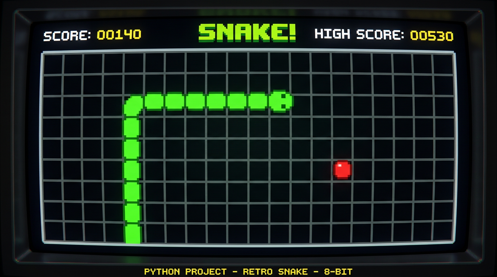

# 🐍 Python Snake Game



## Overview

**Python Snake Game** is a classic implementation of the iconic Snake game built entirely in Python. This repository contains multiple versions of the game, including single-player and multiplayer (2-player) modes. The game features retro-style gameplay with modern customization options, making it a fun and educational project for learning Python game development.

## 📋 Table of Contents

- [Overview](#overview)
- [Game Mechanics](#game-mechanics)
- [Features](#features)
- [Game Versions](#game-versions)
- [Installation & Setup](#installation--setup)
- [How to Play](#how-to-play)
- [Controls](#controls)
- [Project Structure](#project-structure)
- [Requirements](#requirements)

## 🎮 Game Mechanics

### Core Gameplay

1. **Snake Movement**: The snake continuously moves in the direction the player inputs. You can change direction using arrow keys or WASD.

2. **Food Collection**: 
   - Food appears randomly on the game board
   - Each time the snake eats food, it grows by one segment
   - Your score increases with each food collected
   - Eating food is the primary objective

3. **Growth Mechanic**:
   - The snake starts with 3 segments (head + 2 body parts)
   - Each food consumed adds one segment to the snake's tail
   - The longer the snake, the more challenging the game becomes

4. **Speed Progression**:
   - The game gradually increases in difficulty as the snake grows
   - Speed increments make the game increasingly challenging
   - Players must react faster to avoid collisions

5. **Collision Detection**:
   - **Wall Collision**: The snake dies if it hits any boundary wall
   - **Self-Collision**: The snake dies if its head touches any part of its body
   - Game Over occurs immediately upon collision

6. **Score System**:
   - Each food collected = +10 points (standard scoring)
   - The longer your snake, the higher your final score
   - Try to beat your high score!

### Game Board

- Fixed-size grid playing area
- Black background with clear visual boundaries
- Food displayed in distinct colors for visibility
- Snake segments clearly outlined for easy tracking

## ✨ Features

- ✅ **Single Player Mode** - Classic gameplay against yourself
- ✅ **2-Player Mode** - Compete with another player on the same keyboard
- ✅ **Progressive Difficulty** - Speed increases as you progress
- ✅ **Score Tracking** - Monitor your performance
- ✅ **Game Over Screen** - Shows final score and statistics
- ✅ **Smooth Controls** - Responsive keyboard input
- ✅ **Retro Graphics** - Classic snake game aesthetic

## 🎯 Game Versions

This repository includes several game implementations:

| File | Mode | Description |
|------|------|-------------|
| `snake1.py` | Single Player | Classic single-player snake game |
| `2playerTesting.py` | 2-Player | Two snakes competing simultaneously |
| `Snake-2-player_modify.py` | 2-Player (Enhanced) | Improved 2-player version with modifications |
| `player 2_players.py` | 2-Player | Alternative 2-player implementation |

## 💻 Installation & Setup

### Prerequisites

- **Python 3.6 or higher**
- **Pygame library** (for graphics and game handling)

### Step 1: Install Python

If you don't have Python installed, download it from [python.org](https://www.python.org/downloads/)

Verify installation:
```bash
python --version
```

### Step 2: Install Pygame

Pygame is required to run the game. Install it using pip:

```bash
pip install pygame
```

Or for Python 3:
```bash
pip3 install pygame
```

### Step 3: Clone the Repository

```bash
git clone https://github.com/ToniGift/Python_Snake_Game.git
cd Python_Snake_Game
```

### Step 4: Run the Game

**For Single Player Mode:**
```bash
python snake1.py
```

**For 2-Player Mode:**
```bash
python 2playerTesting.py
```

Or try other 2-player versions:
```bash
python Snake-2-player_modify.py
python "player 2_players.py"
```

## 🕹️ How to Play

1. Launch the game using one of the commands above
2. The game window will open showing the game board
3. Your snake starts in the center with 3 segments
4. Food appears as a target on the board
5. Navigate the snake to eat the food
6. Avoid hitting walls and yourself
7. Continue eating food to grow longer and increase your score
8. The game ends when you collide with a wall or yourself

## ⌨️ Controls

### Single Player Mode

| Key | Action |
|-----|--------|
| ⬆️ Arrow Up or `W` | Move Up |
| ⬇️ Arrow Down or `S` | Move Down |
| ⬅️ Arrow Left or `A` | Move Left |
| ➡️ Arrow Right or `D` | Move Right |
| `ESC` or Close Window | Quit Game |

### 2-Player Mode

**Player 1:**
- `W` - Move Up
- `S` - Move Down
- `A` - Move Left
- `D` - Move Right

**Player 2:**
- ⬆️ Arrow Up - Move Up
- ⬇️ Arrow Down - Move Down
- ⬅️ Arrow Left - Move Left
- ➡️ Arrow Right - Move Right

## 📁 Project Structure

```
Python_Snake_Game/
├── snake1.py                    # Single-player version
├── 2playerTesting.py            # 2-player version (testing)
├── Snake-2-player_modify.py     # 2-player version (modified)
├── player 2_players.py          # 2-player version (alternative)
├── post-07.png                  # Gameplay screenshot
├── game.png                     # Game reference image
├── gameover101.png              # Game over screen image
├── gameover2.jpg                # Alternative game over screen
└── README.md                    # This file
```

## 📦 Requirements

```
pygame>=1.9.6
```

To view all requirements:
```bash
pip list
```

## 🚀 Tips & Tricks

- **Practice Movement**: Start by playing slowly to understand the controls
- **Plan Ahead**: Think about where the snake will go next, not just immediate moves
- **Avoid Corners**: Don't trap yourself in corners; maintain open paths
- **Speed Control**: Take your time in early stages; speed will increase naturally
- **2-Player Strategy**: In multiplayer, use walls and your body as defensive barriers
- **High Score Challenge**: Try to beat your previous high scores!

## 🐛 Troubleshooting

**Issue: "ModuleNotFoundError: No module named 'pygame'"**
- Solution: Run `pip install pygame` to install the required library

**Issue: Game window won't open**
- Solution: Ensure you're using Python 3.6 or higher
- Try: `python3 snake1.py` instead of `python snake1.py`

**Issue: Controls not responding**
- Solution: Click on the game window to ensure it has focus
- Ensure NumLock is on if using arrow keys

## 📝 Notes

- This is a learning project showcasing Python game development with Pygame
- The game uses event-driven programming for smooth gameplay
- Multiple game modes demonstrate different implementation approaches
- Great for understanding game loops, collision detection, and user input handling

## 🤝 Contributing

Feel free to fork this repository and add your own features! Some ideas:
- Power-ups system
- Difficulty levels
- Sound effects and music
- Leaderboard system
- Obstacle fields
- Different game modes

## 📄 License

This project is open source and available for educational purposes.

---

**Happy Gaming! 🎮** Try to beat your high score!

**Last Updated**: March 6, 2026